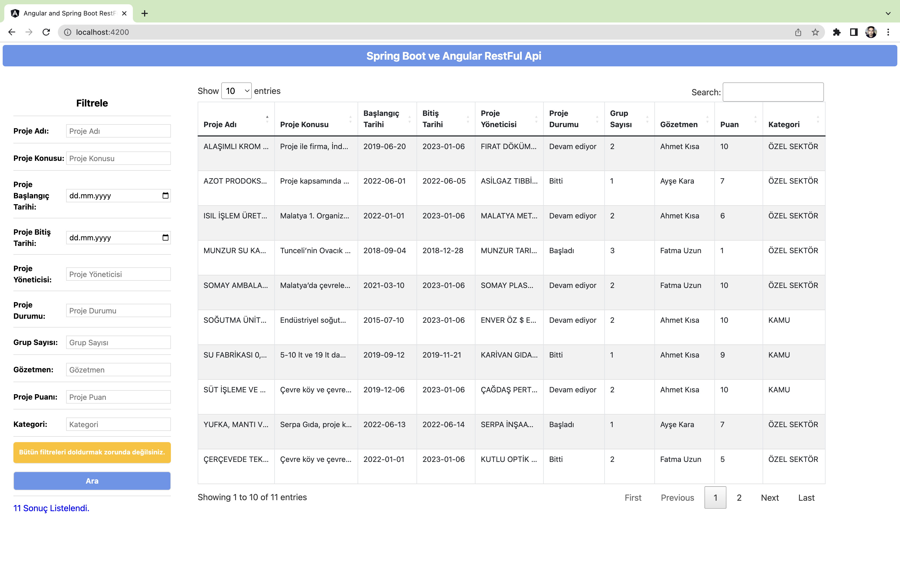
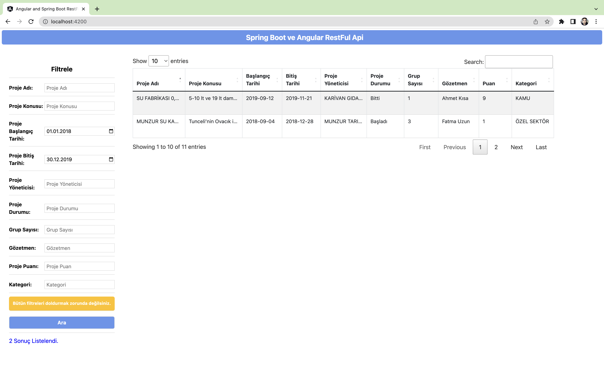
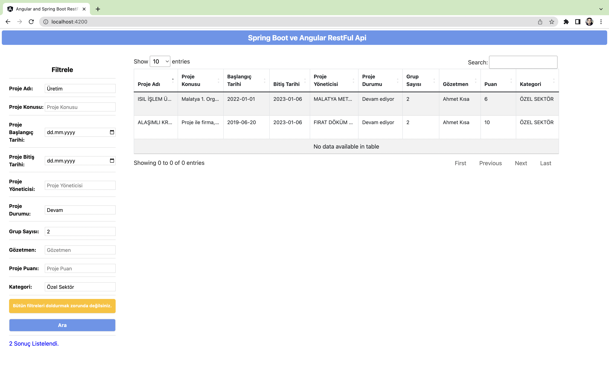

# Java-Spring-Boot-and-Angular-and-MariaDb-RestFul-Api-Example
### Example of Restful Api that lists the desired criteria I have made using Java Spring Boot and Angular





## Back-End;
- Spring Boot 2.7.0
- Lombok
- Hibernate - JPA
- MariaDB(Mysql) 10.6.4

## Front End;
- Angular CLI: 13.3.7
- Scss


## Run Project


### Spring Boot;
```
just run
```
```
http://localhost:81/api/project-filter
```

### Angular;
``` 
npm install
ng serve
```
```
http://localhost:4200/
```

```
Angular 4200 portunda çalışmalı. Yoksa 'has been blocked by CORS' hatası verecektir.
Spring Boot tarafında @CrossOrigin(origins = "http://localhost:4200") şeklinde ayarlamayı yaptım. 
```


